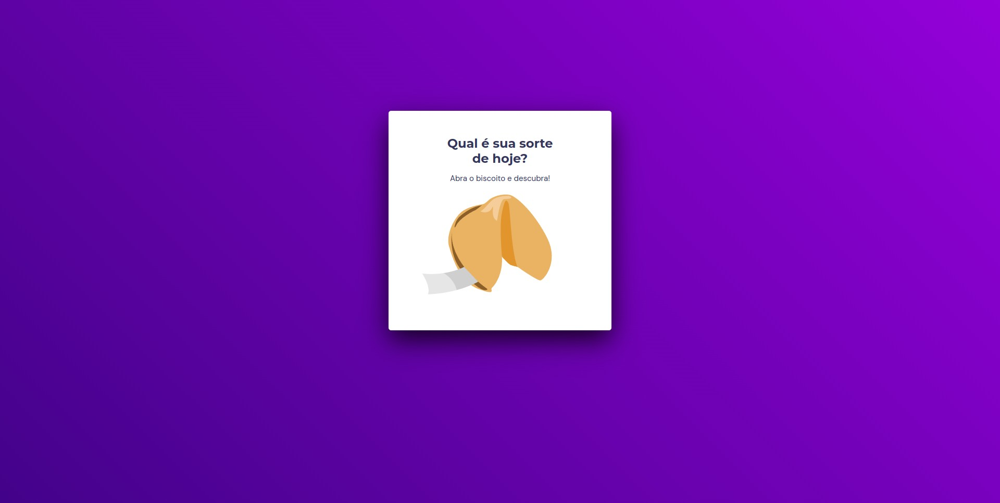
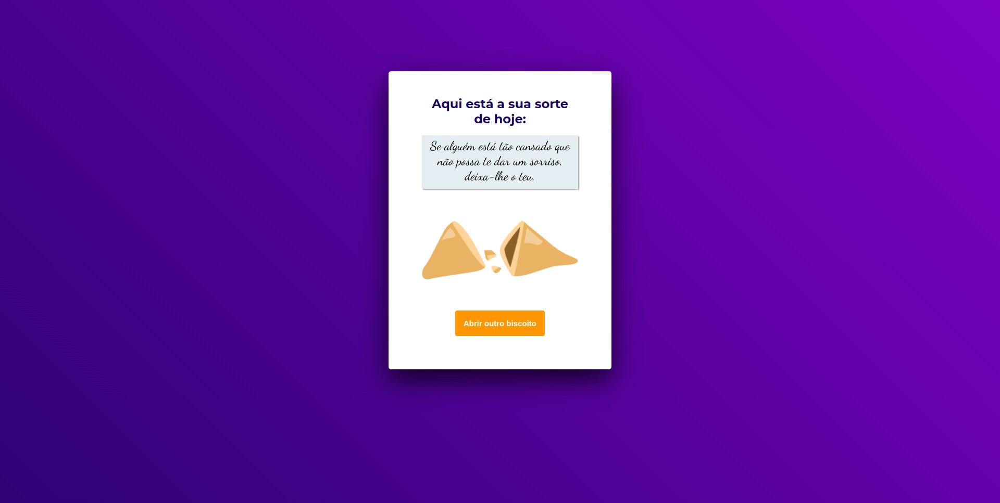

Projeto realizado no treinamento do Explorer da Rocketseat  
<a href="https://www.rocketseat.com.br/explorer">Estude esse projeto em formato de vídeo clicando aqui.</a>

  <a href="#-tecnologias">Tecnologias</a>&nbsp;&nbsp;&nbsp;|&nbsp;&nbsp;&nbsp;
  <a href="#memo-licença">Licença</a>

  

 

  
  

## 🚀 Tecnologias

Esse projeto foi desenvolvido com as seguintes tecnologias:

- HTML e CSS
- JavaScript
- Git e Github
- Figma

## 💻 Projeto

Biscoito da Sorte

Neste projeto foi utilizado: manipulação de DOM, funções no JavaScript, funções callback, animações com CSS, Grid, background com gradiente animado, entre outros.

## :memo: Licença

Esse projeto está sob a licença MIT.

---

Feito com ♥ by Rocketseat :wave: [Participe da nossa comunidade!](https://discord.gg/rocketseat)